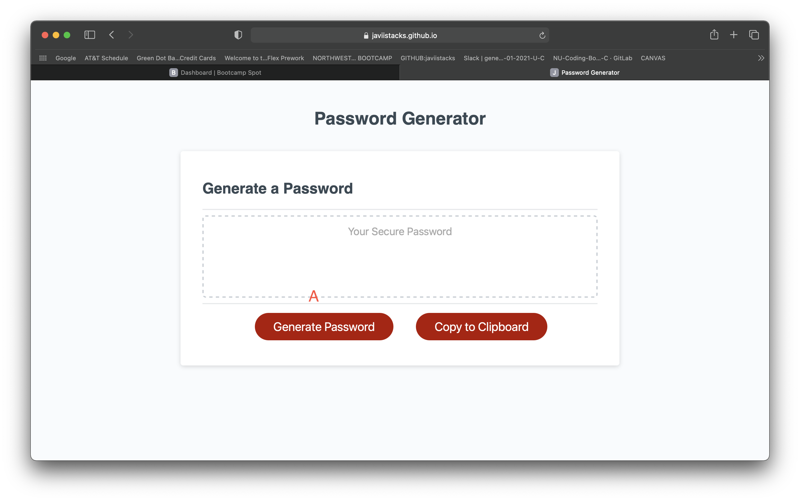
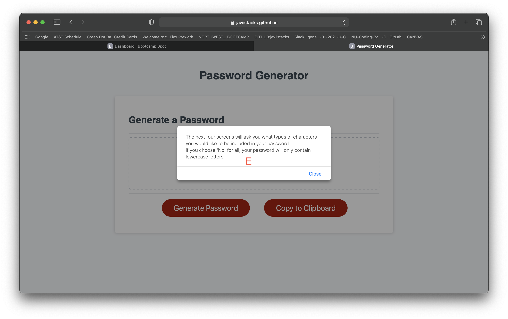

# passwordgenerator
# 03 JavaScript: Password Generator

A. In the beginning the user is presented with the start screen where the user will click on "Generate Password" to begin choosing how complex they want thier password to be.

B. User is Alerted with prompt screen to choose between 8 to 128 characters for password length.

C. User input value of desired number length for password.

E. User is Alerted with prompt screen, Educating them about the next four questions that they will be asked to determine their password strength.

F. User is prompted if they would like to include uppercase letters in their password.

G. User is prompted if they would like to include lowercase letters in their password.

H.  1. The user can only answer with YES, Yes, yes, Y,and y.
    2. The user can only answer with NO, No, no, N, and n. 
    3. If user asnwers with anything else not listed above, it will prompt user to choose yes or no only.

I. User is prompted if they would like to include numbers in their password.

J. User is prompted if they would like to inlude special characters in their password.

K. Password is generated for user.

L.  I added a Copy Button to make it a more user friendly. Which copies password to clipboard.

--------------------------------------------------------------------------------------------------------------------------

My Git hub profile : https://github.com/javiistacks

Git Hub repository: https://github.com/javiistacks/passwordgenerator

Finished Product: https://javiistacks.github.io/passwordgenerator/
